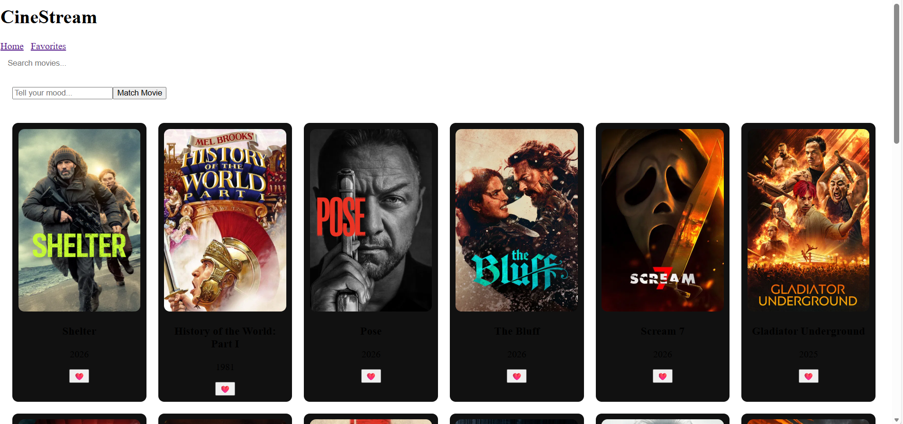

#  Cine-Stream

Cine-Stream is a movie discovery web application built using **React, Node.js, Express and TMDB API**.
It allows users to explore popular movies, search for movies, save favorites and get **AI based movie suggestions using mood input**.

##  Features

*  Search movies using TMDB API
*  AI Mood Matcher to suggest movies based on user mood
*  Add movies to Favorites using LocalStorage
*  Infinite Scroll to automatically load more movies
*  Lazy loading for movie posters for better performance

## 🛠 Tech Stack

Frontend:

* React
* Vite
* Axios
* React Router

Backend:

* Node.js
* Express

APIs:

* TMDB API (Movie Data)
* Google Gemini API (AI Movie Suggestion)

##  Project Structure

cine-stream
│
├── client (React Frontend)
│ ├── components
│ ├── pages
│ ├── hooks
│ └── services
│
└── server (Node.js Backend)
└── index.js

## ⚙️ Setup

Install frontend dependencies

```
cd client
npm install
```

Install backend dependencies

```
cd server
npm install
```

Create `.env` file in **server**

```
GEMINI_API_KEY=your_gemini_api_key
```

Create `.env` file in **client**

```
VITE_TMDB_KEY=your_tmdb_api_key
```

Run backend

```
node index.js
```

Run frontend

```
npm run dev
```

##  Purpose

This project demonstrates modern web development concepts like **API integration, React hooks, infinite scroll, debouncing, lazy loading and AI integration**.

## YouTube Link
https://youtu.be/tZ_zDnca8TE?si=-YQVeBwHd7i1OSZ-

##  Home Page

